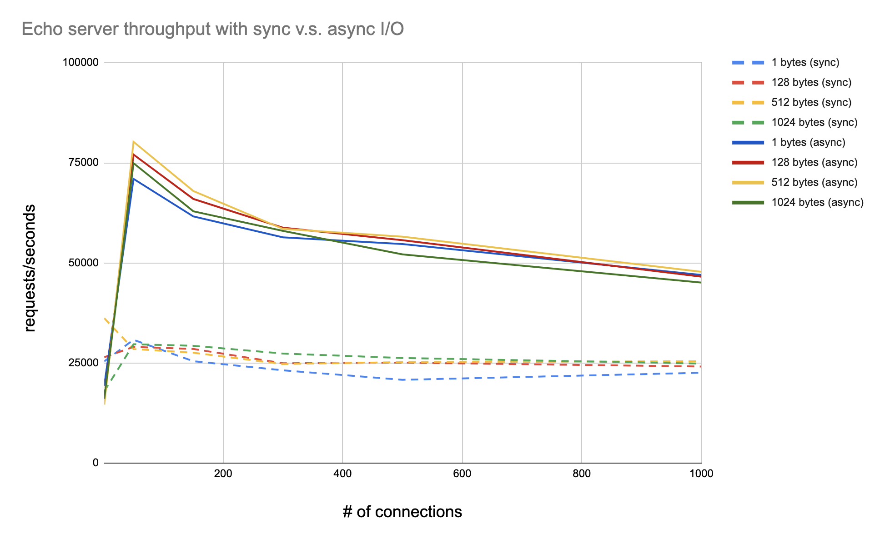

# Rocket I/O Library Benchmarks

## System Setup
* Macbook Pro 2.9GHz 6-Ccore Intel Core i9, 32GB RAM
* Ubuntu 21.10 virtual machine on VMware Fusion with 2 processor cores, 4GB RAM
* Linux kernel version 5.13.0-37-generic
* Each benchmark runs on a dedicated CPU with `taskset -cp 0 [pid]`

## File I/O Benchmarks

### Workload
* N threads/fibers running. Each thread runs a loop with C iterations.
* In each iteration, do the following:
    * Open a file.
    * Write S bytes to the file.
    * Read S bytes from the file.
    * Close the file.

* Run the workload using the following setups:
  * pthreads + synchronous file IO (i.e. `open`, `read`, `write`, etc).
  * rocket fibers + asynchronous file IO (i.e. `openat_await`, `readat_await`,
    `writeat_await`, etc).

### Benchmark Tool
```
$ ./configure
$ make benchmark_file_io

$ ./benchmark_file_io -n <# of threads> -c <cycles per thread> -s <I/O size>
```

### Result

It seems that fibers + asynchronous I/O performs better with big I/O size.

```
# 20 threads/fibers, 40960 cycles per thread/fiber, I/O size 4096 bytes
$ taskset -c 0 ./benchmark_file_io -n 20 -c 40960 -s $((4096))
------------------------------------------------------
Benchmarking read write files with pthreads with params:
[20 threads, 40960 IO cycles per thread, 4096 bytes per IO]

Finished read write files with pthreads in 3.080574 seconds CPU time, 3.204602 seconds real time
------------------------------------------------------
------------------------------------------------------
Benchmarking read write files with fibers with params:
[20 threads, 40960 IO cycles per thread, 4096 bytes per IO]

Finished read write files with fibers in 8.670622 seconds CPU time, 8.071487 seconds real time
------------------------------------------------------

# 20 threads/fibers, 10 cycles per thread/fiber, I/O size 4096 bytes
$ taskset -c 0 ./benchmark_file_io -n 20 -c 10 -s $((4096*4096))
------------------------------------------------------
Benchmarking read write files with pthreads with params:
[20 threads, 100 IO cycles per thread, 16777216 bytes per IO]

Finished read write files with pthreads in 18.594572 seconds CPU time, 18.703488 seconds real time
------------------------------------------------------
------------------------------------------------------
Benchmarking read write files with fibers with params:
[20 threads, 100 IO cycles per thread, 16777216 bytes per IO]

Finished read write files with fibers in 18.787355 seconds CPU time, 15.500546 seconds real time
------------------------------------------------------
```

TODOs:
* Analyze the performance of asynchronous I/O with small I/O size.
* Add benchmarks for I/O throughput in addition to latency.

## Socket I/O Benchmark

### Workload
* A simple echo server.

* Run the workload using the following setups:
  * pthreads + synchronous file IO (i.e. `accept`, `send`, `recv`, etc).
  * rocket fibers + asynchronous file IO (i.e. `accept_await`, `send_await`,
    `recv_await`, etc).

### Benchmark Tool
```
# Echo server
$ ./configure
$ make echo_server

$ ./echo_server [-a]
```

Also used [rust_echo_bench](https://github.com/haraldh/rust_echo_bench) to run
echo clients to benchmark the server in sync and async mode and borrowed the
script
[here](https://github.com/frevib/io_uring-echo-server/blob/master/benchmarks/benchmarks.md).

### Result (requests/second)



**pthread with sync IO**

| clients    | 1     | 50    | 150   | 300   | 500   | 1000  | 
|:----------:|:-----:|:-----:|:-----:|:-----:|:-----:|:-----:|
| 1 bytes    | 25401 | 30781 | 25438 | 23171 | 20787 | 22554 |
| 128 bytes  | 26425 | 29009 | 28498 | 24927 | 25082 | 24113 |
| 512 bytes  | 36181 | 28479 | 27562 | 24740 | 25206 | 25427 |
| 1000 bytes | 17911 | 29677 | 29285 | 27348 | 26235 | 24854 |

**fiber with async IO**

| clients    | 1     | 50    | 150   | 300   | 500   | 1000  | 
|:----------:|:-----:|:-----:|:-----:|:-----:|:-----:|:-----:|
| 1 bytes    | 19306 | 70974 | 61603 | 56377 | 54687 | 46974 |
| 128 bytes  | 16017 | 77027 | 65971 | 58773 | 55656 | 46560 |
| 512 bytes  | 14595 | 80230 | 67947 | 58486 | 56545 | 47767 |
| 1000 bytes | 16072 | 74897 | 62880 | 57987 | 52125 | 45069 |

The result shows that fiber + async I/O performs better with concurrent
clients.
